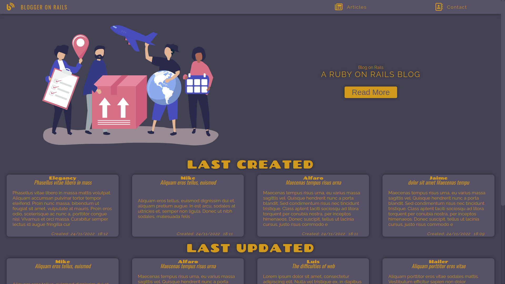
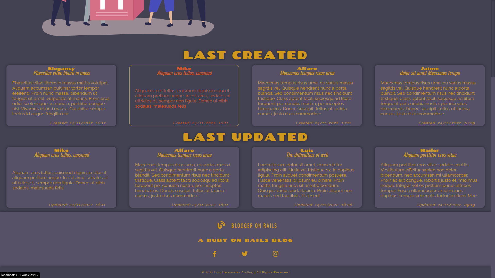
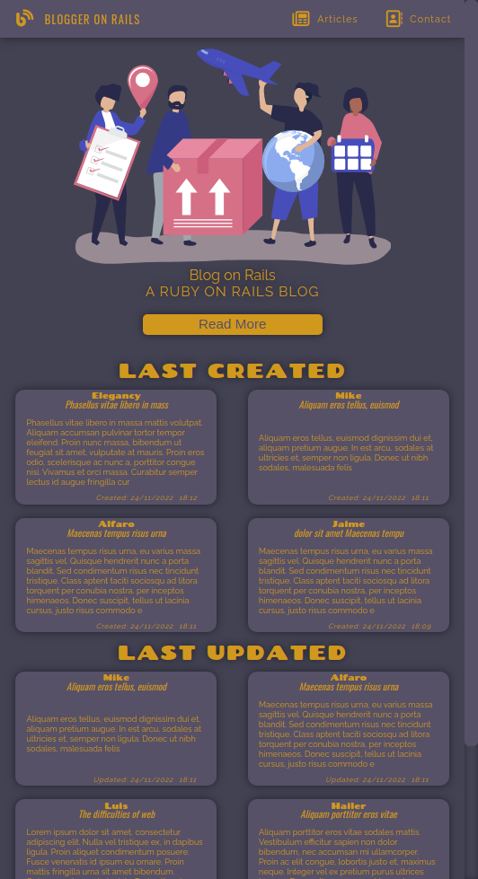
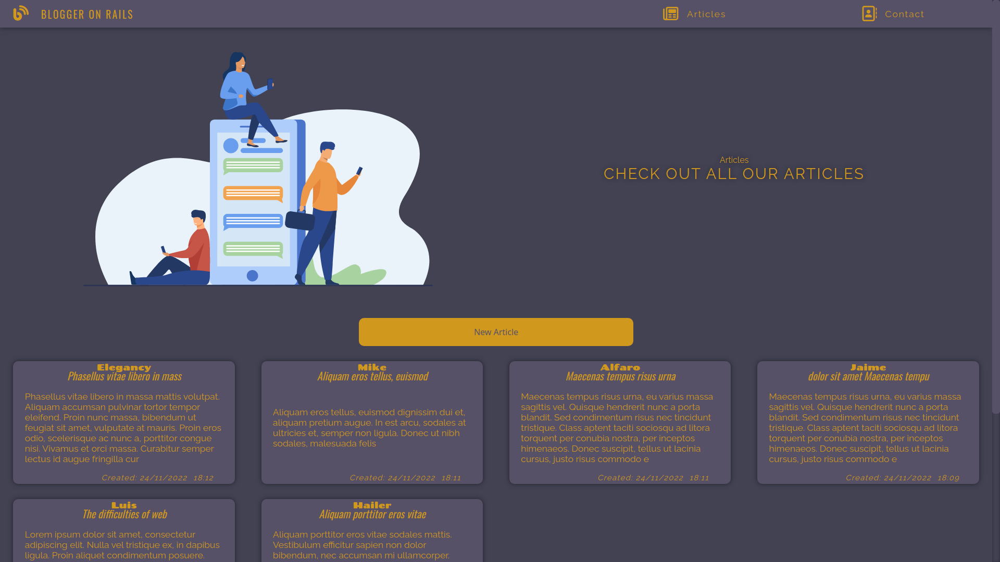
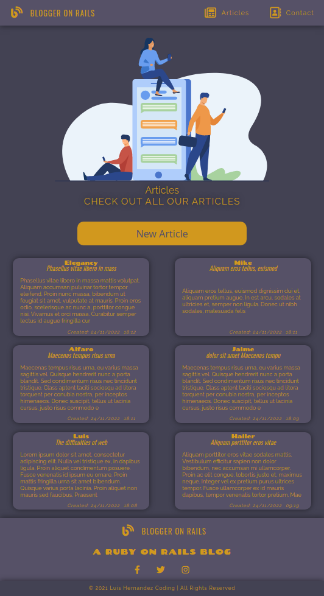
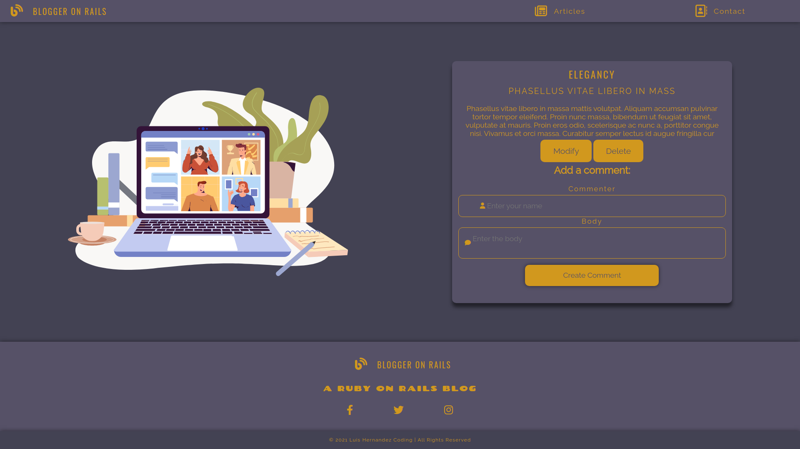
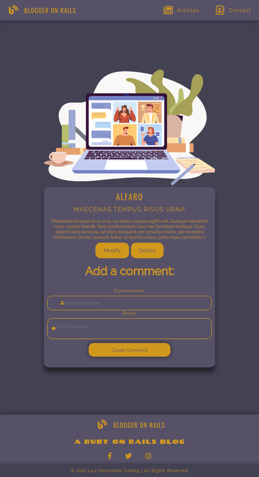
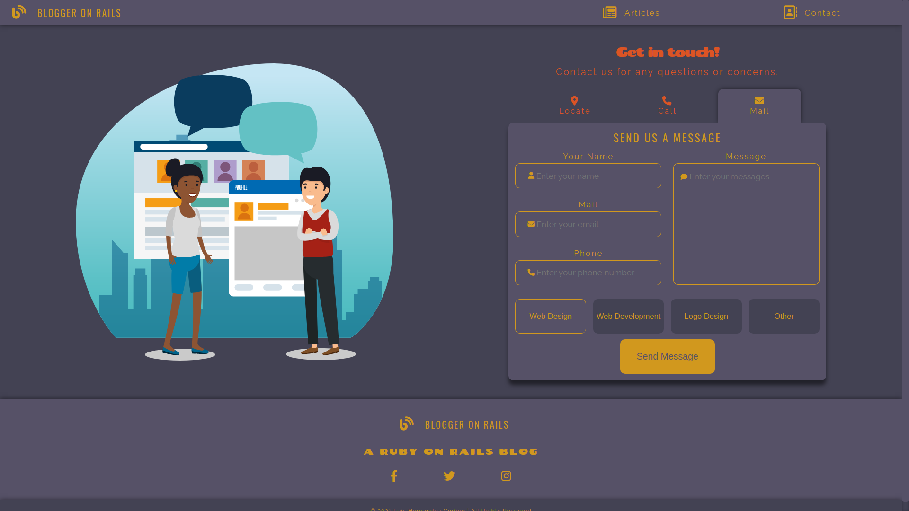
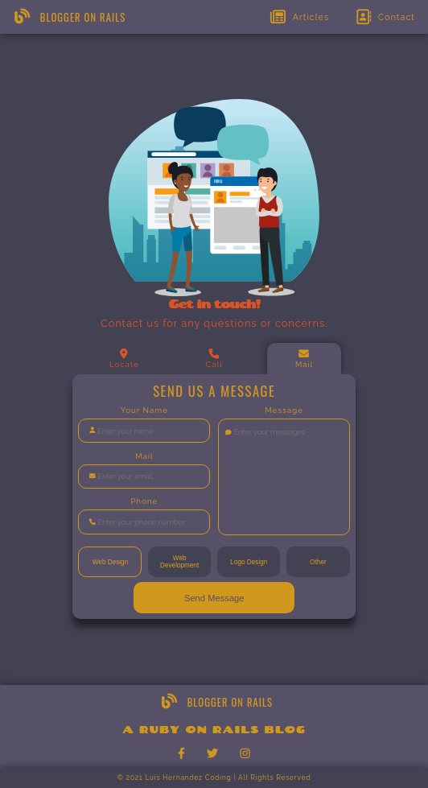

# Blogger on Rails

In this project I will create a blogger web app with Ruby on Rails. I will use css for the front end but i'm not using javascript because its out of the scope of the project

###### - Extra: its made with responsive approach in mind (test it on small screens)

Live demo its not available at the moment

## Previews
> home preview

>
> home preview 2

>
> home preview small

>
> articles preview

>
> articles small preview

>
> articles view preview

>
> articles small view preview

>
> contact preview

>
> contact small preview

>

## The project

#### Definition

The project is a blog web app made with Ruby on Rails. It has a home page, articles page, articles view page and a contact page, you can add new articles or even comment on the previous one

#### Features

- Home page
- Articles page
- Articles view page
- Articles new/edit page
- Comments on articles
- Contact page
- Responsive approach

## Learning outcome

##### Learning Goals / Areas of Focus

- Learn how to create a web app with Ruby on Rails
- Learn how to create a database and models with Ruby on Rails
- Learn how to create a controller and views with Ruby on Rails
- Learn how to create a form with Ruby on Rails
- Learn how to create a comment system with Ruby on Rails
- Learn how to use css for styling
- Learn how to use git and github for version control

## Built With

- Ruby on Rails
- Ruby
- SQLite3
- HTML
- CSS

## Getting Started

To get a local copy up and running follow these simple example steps.

### Prerequisites

- Ruby
- Rails
- Bundler

### Setup

- Clone the repository to your local machine
- Run `bundle install` to install the required gems
- Run `rails db:migrate` to create the database
- Run `rails server` to start the server
- Go to `localhost:3000` to see the web app

### Run tests

- Run `rubocop` to run the test suite

## Author

👤 **Luis Hernandez**

- GitHub: [@LuisHernandezCoding](
